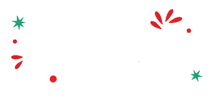

# GoGrabify - Ultimate Video Downloader



> **Live Demo:** [gograbify-front-end.vercel.app](https://gograbify-front-end.vercel.app/)

## 🚀 Overview

**GoGrabify** is a modern, high-performance video downloader application built with the latest web technologies. It allows users to easily download videos from multiple social media platforms including Instagram, Facebook, TikTok, and YouTube.

Designed with a mobile-first approach and a sleek, user-friendly interface, GoGrabify ensures a seamless experience across all devices.

## ✨ Key Features

- **📸 Instagram Downloader**: Download Videos, Reels, and Photos.
- **📘 Facebook Downloader**: Save public Facebook videos in high quality.
- **🎵 TikTok Downloader**: Download TikTok videos without watermarks.
- **▶️ YouTube Downloader**: Extract videos and audio from YouTube links.
- **⚡ Fast & Responsive**: Optimized for speed and works on all screen sizes.
- **🔒 Privacy Focused**: No user data collection or registration required.

## 🛠️ Tech Stack

This project is built using the bleeding-edge stack for optimal performance and developer experience:

- **Framework**: [Next.js 16](https://nextjs.org/) (App Router)
- **Language**: [TypeScript](https://www.typescriptlang.org/)
- **Styling**: [Tailwind CSS 4](https://tailwindcss.com/)
- **Icons**: [Lucide React](https://lucide.dev/) & [React Icons](https://react-icons.github.io/react-icons/)
- **UI Components**: Custom components with [Class Variance Authority](https://cva.style/) & [clsx](https://github.com/lukeed/clsx)
- **Toast Notifications**: [Sonner](https://sonner.emilkowal.ski/)

## 📦 Getting Started

Follow these steps to set up the project locally on your machine.

### Prerequisites

Ensure you have the following installed:

- [Node.js](https://nodejs.org/en/) (v18 or higher)
- [npm](https://www.npmjs.com/), [yarn](https://yarnpkg.com/), [pnpm](https://pnpm.io/), or [bun](https://bun.sh/)

### Installation

1. **Clone the repository:**

   ```bash
   git clone https://github.com/yourusername/gograbify.git
   cd gograbify
   ```

2. **Install dependencies:**

   ```bash
   npm install
   # or
   yarn install
   # or
   pnpm install
   # or
   bun install
   ```

3. **Run the development server:**

   ```bash
   npm run dev
   # or
   yarn dev
   # or
   pnpm dev
   # or
   bun dev
   ```

4. **Open your browser:**
   Navigate to [http://localhost:3000](http://localhost:3000) to see the application running.

## 📂 Project Structure

The project follows a feature-based architecture for better scalability and maintainability:

```
gograbify/
├── app/                  # Next.js App Router pages
├── components/           # Shared UI components
├── features/             # Feature-specific modules
│   ├── home/             # Landing page components
│   ├── instagram/        # Instagram downloader logic
│   ├── facebook/         # Facebook downloader logic
│   ├── tiktok/           # TikTok downloader logic
│   └── youtube/          # YouTube downloader logic
├── public/               # Static assets
└── lib/                  # Utility functions
```

## 🤝 Contributing

Contributions are welcome! Please feel free to submit a Pull Request.

1. Fork the project
2. Create your feature branch (`git checkout -b feature/AmazingFeature`)
3. Commit your changes (`git commit -m 'Add some AmazingFeature'`)
4. Push to the branch (`git push origin feature/AmazingFeature`)
5. Open a Pull Request

## 📄 License

This project is licensed under the MIT License - see the [LICENSE](LICENSE) file for details.
